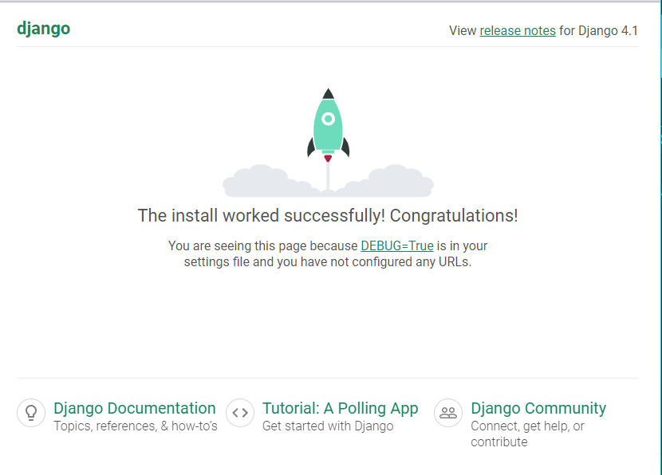

# PyShop: 入门级Django项目

## 环境

```
django==4.1
python==3.8.6
```

## 创建虚拟环境并安装django

也许需要一些前置知识，比如 [venv& virtualenv 的使用](https://www.cnblogs.com/doublexi/p/15783355.html)

这里使用的是virtualenv，为此项目创建一个名为dj41py386的环境：

```bash
virtualenv dj41py386 -python=python3.8.6
```

运行dj41py386文件夹下的Scripts\activate 就能进入虚拟环境

安装django

```bash
pip install django==4.1
```

用django创建名为pyshop的新项目

```
django-admin startproject pyshop
```

执行命令后当前文件夹下会出现pyshop文件夹，其文件树如下

```
..\PYSHOP
│   db.sqlite3 # sqlite数据库文件
│   manage.py # 
│   
└───pyshop
    │   asgi.py
    │   settings.py
    │   urls.py
    │   wsgi.py
    │   __init__.py
    │   
    └───__pycache__
```

只要在manage.py所在文件夹下执行如下指令，就能开始运行默认的web服务器

```
python manage.py runserver
```

然后就能在`http://localhost:8000/` 或者 `http://127.0.0.1:8000/`看到如下的页面，表示运行成功



## 创建Products app

django项目往往由多个负责单一功能的app来组成，以提高内聚和复用性

在这个项目中，我们新建代表商品的app： products

```
python manage.py startapp products
```

执行startapp后，最外层的pyshop文件夹下出现了一个products文件夹，内容如下

```
...\PRODUCTS
│   admin.py	# Register your models here.
│   apps.py		# configurations 
│   models.py	# representation of real world concept
│   tests.py	# automatic test code
│   views.py	# pages and views
│   __init__.py
│
└───migrations
        __init__.py
```

### views.py

在view.py里写函数对应到的http响应

views中的函数决定显示怎样的网页，向网页输送怎样的信息

### urls.py

创建urls.py，其中引入views.py中的函数，目的是完成url到网页的对应

### models.py

models.py 使用自带的models.Model类为基础，该类定义了常见的与数据库的交互逻辑

写好models.py 后，将products引入到pyshop文件夹下的settings.py里，即在settings.py的`INSTALLED_APP`里加入如下一行（即products的app.py文件里的class名称）：

```
    'products.apps.ProductsConfig'
```

然后运行makemigrations命令，migration是改变的意思，在django语境下大多指model数据模式的变化，makemigrations即创建改变

```
python models.py makemigrations
```

结果如下

```
Migrations for 'products':
  products\migrations\0001_initial.py
    - Create model Product
```

然后我们能在migrations文件夹里看到0001_initial.py记录了此次的migration

此时的数据库db.sqlite3文件里还没有任何东西

运行migrate，运行这些改变

```
python manage.py migrate
```

数据库软件使用 [DB Browser of SQLite]( https://sqlitebrowser.org/)

用DB Browser of SQLite打开db.sqlite3，然后我们就能在其中看到要存储的一切数据

每当建立了一个新的model，或者给已有的model加入新的数据，就要重新先makemigrations再进行migrate，类似于将app的新特性，新功能所需要的新的数据结构同步到数据库里，在数据库里开辟一块新空间来存储新内容

## 关于admin

django自带管理系统

创建管理员，设置账号密码邮箱并登陆

```
python manage.py createsuperuser
```

下一步是在admin.py里对products进行管理

只需要将models.py里的Product类引入过来，并调用register方法即可，django做的确实很人性化，封装的很高级

整个admin.py如下

```
from django.contrib import admin
from .models import Product

# Register your models here.
admin.site.register(Product)
```

保存刷新，就能在admin页面里看到新的一类Products

通过admin中的添加就能向数据库里添加新产品，而后我们将这些产品展示在网页里

## 写网页模板

然后在products下创建template文件夹，存放Products对应的网页模板，写index.html，然后在views里render这个页面

然后就能在网页里看到index.html的内容

自己从零写一个网页太丑了，所以推荐 [html模板网站](https://getbootstrap.com/docs/5.2/getting-started/introduction/)

在此项目中使用的 [card单元](https://getbootstrap.com/docs/5.2/components/card/)

webserver的用途就是将url对应到页面，对应到函数，并且将页面上的操作与信息反映到程序和数据库里

## 问题：

当登陆admin页面的时候google浏览器会弹出data breach的风险提示，这是为什么呢？是因为检测到你的账号密码被传入到了本机？或者被本机上的其他地方获取了？账号密码是怎么跟服务器交互的？

部署到服务器上？把项目往上海的服务器上部署一遍，图片换成墙内的网址

如何测试网站能承载的流量，在本机先尝试做一下测试，然后找测试工具对你的服务器试一下

网页写好看点，看商城的其他模块，是否能添加进去

可能的扩展：先用golang，后用flask重构一遍

下个项目：golang简陋webserver实现

## 后记：

项目教程还是要看第二遍才能理解每个操作的含义，第一遍看的时候只顾做了，理不清各个模块各个操作之间的关系，不懂每一项操作的作用，还是至少要来第二遍才最有营养。

## 参考：

[项目来源: Mosh youtube](https://www.youtube.com/watch?v=_uQrJ0TkZlc&list=PLyN7oxIwNU8HIFoj5EggUyJPtGY2WQ1Px&ab_channel=ProgrammingwithMosh)

[Django官网教程](https://docs.djangoproject.com/zh-hans/4.1/intro/tutorial01/)

[DB Browser for SQLite]( https://sqlitebrowser.org/)

[Bootstrap模板网站](https://getbootstrap.com/docs/5.2/getting-started/introduction/)
